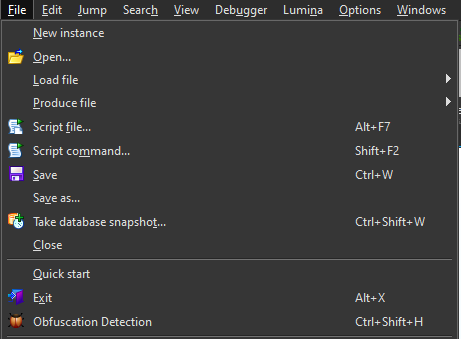
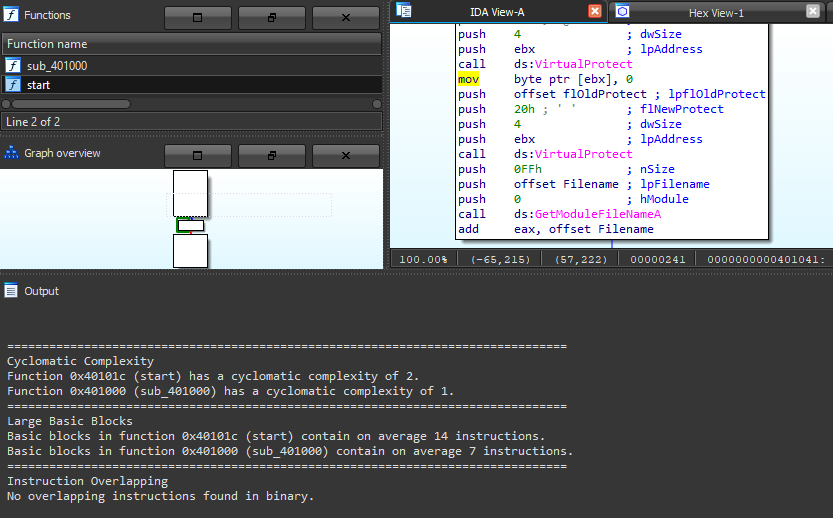
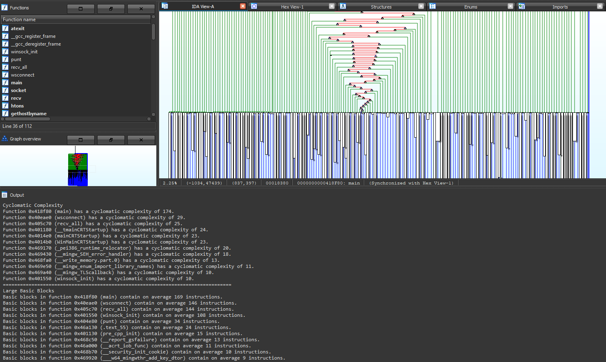
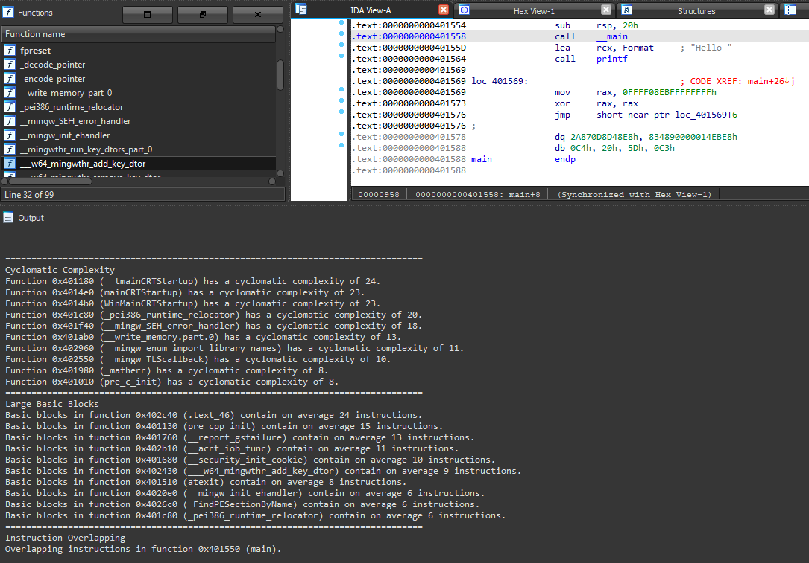

# Obfuscation Detection
[]() []() []()

Authored by: **Tim Blazytko**

Adapted by: **mcdulltii**

_Automatically detect obfuscated code and other state machines_

## Description:

Scripts to automatically detect obfuscated code and state machines in binaries.

Implementation is based on IDA 7.4+ (Python3). Check out the following blog posts for more information on the Binary Ninja implementation:

* [Automated Detection of Control-flow Flattening](https://synthesis.to/2021/03/03/flattening_detection.html)
* [Automated Detection of Obfuscated Code](https://synthesis.to/2021/08/10/obfuscation_detection.html)
* [Referenced Repository](https://github.com/mrphrazer/obfuscation_detection)

## Note:

Due to the recursive nature of plotting a dominator tree of every found function within the binary, the implementation and runtime overhead is expensive, though threading has been implemented.

```Python
MAX_FUNCTIONS = 50
MAX_NODES = 50
# --- snipped ---
if sum([1 for _ in idautils.Functions()]) > MAX_FUNCTIONS:
    detect.partial_heur()
else:
    detect.all_heur()
# --- snipped ---
if sum([1 for _ in FlowChart(get_func(ea))]) > MAX_NODES:
    pass
```

For more details on `partial_heur()` and `all_heur()`:

`all_heur()` calls all heuristic functions on the binary, then prints an output of the heuristics of all functions within the binary.

`partial_heur()` calls all heuristic functions on the binary, then prints an output of the heuristics of the top 10% (or bounded by `MAX_FUNCTIONS`) functions within the binary.

Instruction overlapping heuristic algorithm makes use of [mcsema disassembly code](https://github.com/lifting-bits/mcsema) to follow jmp and call instructions for better coverage.

Since the script uses the IDA API, any functions that are missed by IDA will likely not be detected.

## Usage

Copy the `obfDetect` directory and `obfDetect.py` into the IDA Plugins directory.

When IDA has successfully finished loading a binary, the script will print out its banner into the IDC/Python console. If not, the script can be re-loaded using `alt-E` and selecting it within the plugin dropdown.

The script can be run via the `File` toolbar as shown below. Alternatively, `Ctrl-Shift-H`.



## Examples

- A small binary with 2 scanned functions



- Resilience test using a large binary obfuscated using O-LLVM



- Instruction overlapping heuristic detection



## Todo

- GUI Implementation [branch](https://github.com/mcdulltii/obfDetect/tree/gui)