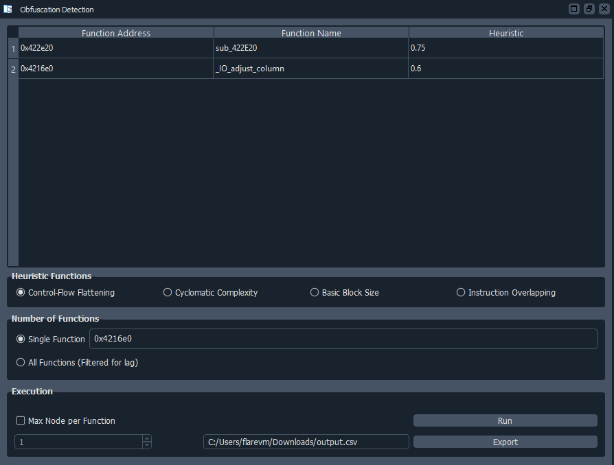

# Obfuscation Detection
  

Authored by: **mcdulltii**

_Automatically detect obfuscated code and other state machines_

## Description:

Scripts to automatically detect obfuscated code and state machines in binaries.

Implementation is based on IDA 7.4+ (Python3). Check out the following blog posts for more information on the Binary Ninja implementation:

* [Automated Detection of Control-flow Flattening](https://synthesis.to/2021/03/03/flattening_detection.html)
* [Automated Detection of Obfuscated Code](https://synthesis.to/2021/08/10/obfuscation_detection.html)
* [Referenced Repository](https://github.com/mrphrazer/obfuscation_detection)

## Note:

Due to the recursive nature of plotting a dominator tree of every found function within the binary, the implementation and runtime overhead is expensive, though threading has been implemented.

Using PyQt to visualize the plugin, users are able to further customize the heuristic function analysis on the binary.

## Dependencies (Python3)

`PyQt5`

## Installation

Copy the `obfDetect` directory and `obfDetect.py` into the IDA Plugins directory.

When IDA has successfully finished loading a binary, the script will print out its banner into the IDC/Python console. If not, the script can be re-loaded using `alt-E` and selecting it within the plugin dropdown.

The script can be run via the `File` toolbar as shown below. Alternatively, `Ctrl-Shift-H`.

## Features

- Function names in output table can be renamed using `n`, and will thus update IDA's function names specified by its function address

- Export filename input box when clicked, will open a file selection pop-up which can be navigated into a custom save location

## Usage

1. Select Heuristic function
2. Select number/address of binary function to run heuristic function on
3. (Optional) Filter out binary functions with a maximum node size
4. Click `Run` button to start analysis
5. (Optional) Click on `Export filename` input box to select export location, and click `Export` button to export table to `csv` format

## Screenshots

- Base GUI selection

- Heuristic GUI analysis

- Single function heuristic GUI analysis

## Todo

- QTableWidget selected item export
