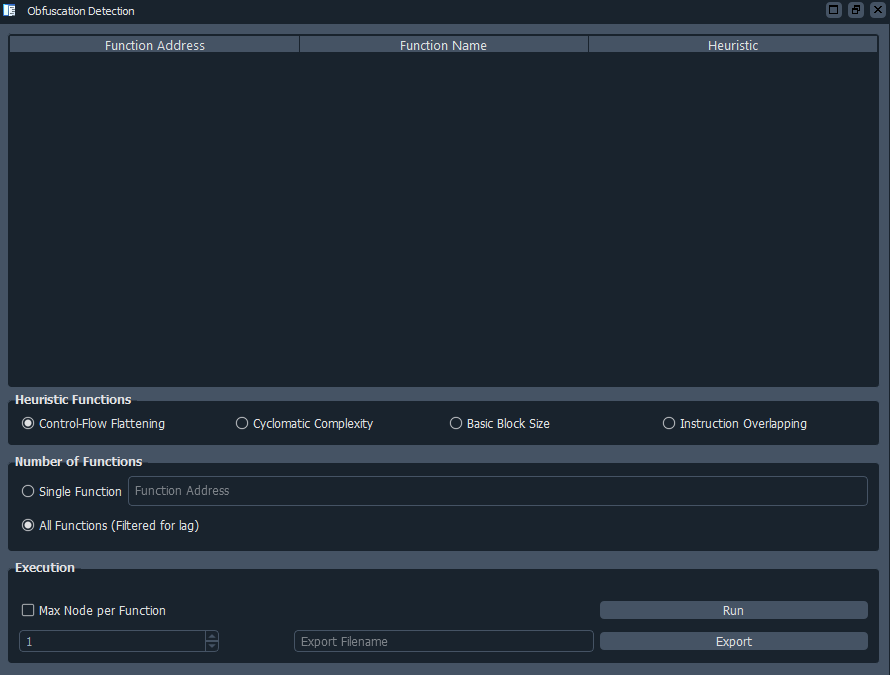
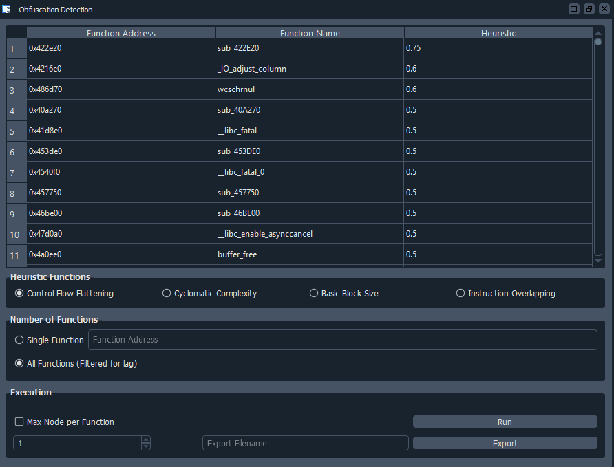

# Obfuscation Detection GUI
  

Authored by: **mcdulltii**

_Automatically detect obfuscated code and other state machines_

## Description:

Checkout [master branch](https://github.com/mcdulltii/obfDetect) for more details on the heuristic analysis.

Using PyQt to visualize the plugin, users are able to further customize the heuristic function analysis on the binary.

## Dependencies (Python3)

`PyQt5`, and optionally, `qdarkstyle` for the IDA theme.

## Usage

Copy the `obfDetect` directory and `obfDetect.py` into the IDA Plugins directory.

When IDA has successfully finished loading a binary, the script will print out its banner into the IDC/Python console. If not, the script can be re-loaded using `alt-E` and selecting it within the plugin dropdown.

The script can be run via the `File` toolbar as shown below. Alternatively, `Ctrl-Shift-H`.

- Base GUI selection

- Heuristic GUI analysis

## Todo

- Execution customizations
- QTableWidget item export
